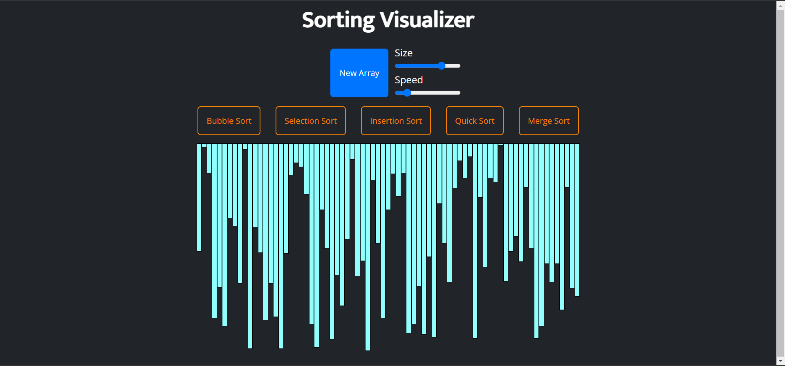

# Sorting Visualizer
A simple visualization project made with pure JavaScript which will help in visualizing some sorting techniques. I implemented all algorithms only for increasing order. The website is completely responsive for various devices.
you will find website link below and also some snapshots.

## Tech Stack:
1. HTML
2. CSS
3. JavaScript

## Sorting Techniques Covered:
1. Bubble Sort
2. Selection Sort
3. Insertion Sort
4. Quick Sort
5. Merge Sort

[Check out the Website here.](https://giriraj191.github.io/sorting_visualizer/)

Here are some snapshots of the website

Default View/On-Load View

Creating New Array

Applying Merge Sort

Running Merge Sort

Complete Merge Sort

The site is responsive for various other devices also. 
Responsiveness of website

Upper-Half

Lower-Half

## Some Notes:
- You will find commented code in this repo.
- You will find various trial console log statements which you can uncomment try your variations of algorithms.

## Thank You : )